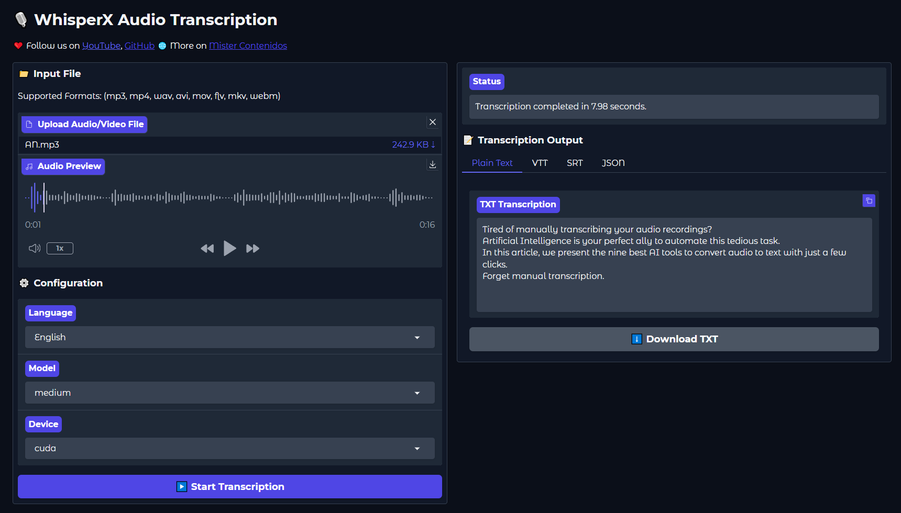

# **WhisperX Local Installation Kit**

## **Description**

This project enables the local installation and use of WhisperX, an advanced audio transcription system based on OpenAI's Whisper but optimized for running on local hardware with or without a GPU. This project is made possible thanks to [Whisperx](https://github.com/m-bain/whisperX) and [Faster Whisper](https://github.com/SYSTRAN/faster-whisper). This document provides a general overview of the installation and links to the website where the [complete installation and usage](https://mistercontenidos.com/en/how-to-install-whisperx-locally) procedure for this project can be found.

---

## **Requirements**

- Miniconda
- CUDA (only for NVIDIA GPU users)

---

## **File Description**

- **`environment-cuda.yml`**: Configuration file for automatic installation on systems with NVIDIA GPU.
- **`environment-cpu.yml`**: Configuration file for automatic installation on systems without NVIDIA GPU.
- **`app.py`**: Script to run the WhisperX user interface on Gradio.
- **`setup_environment_cuda.bat`**: Batch script for easy installation on Windows with NVIDIA GPU (requires CUDA 12.1 or higher).
- **`setup_environment_cpu.bat`**: Batch script for easy installation on Windows without NVIDIA GPU.

---

## **Installation**

### **For Windows Users**

#### **1. NVIDIA GPU Users (with CUDA 12.1 or higher)**:
If you have an NVIDIA GPU and CUDA 12.1 (or higher) installed, you can use the `setup_environment_cuda.bat` script for an easy installation:

1. Download the repository.
2. Double-click the `setup_environment_cuda.bat` file.
3. The script will:
   - Create a virtual environment.
   - Install all necessary dependencies, including GPU-optimized versions of `torch` and `torchaudio`.
4. Once the installation is complete, activate the virtual environment and run the application.

#### **2. Users without NVIDIA GPU**:
If you do not have an NVIDIA GPU, use the `setup_environment_cpu.bat` script:

1. Download the repository.
2. Double-click the `setup_environment_cpu.bat` file.
3. The script will:
   - Create a virtual environment.
   - Install all necessary dependencies, including CPU-only versions of `torch` and `torchaudio`.
4. Once the installation is complete, activate the virtual environment and run the application.

---

### **General Installation (All Platforms)**

1. **Miniconda**: [Miniconda Installation](https://docs.anaconda.com/free/miniconda/)
2. **CUDA**: [CUDA Installation](https://developer.nvidia.com/cuda-toolkit-archive) (Only for NVIDIA GPU users)
3. **GitHub Repository**: Download and setup of the repository. See details on our website.

For a detailed step-by-step installation process, please visit our website: [View complete installation process](https://mistercontenidos.com/en/how-to-install-whisperx-locally)

---

## **Usage**

To use WhisperX after completing the installation:

1. Activate the corresponding Conda environment.
2. Run **`python app.py`** to start the Gradio user interface.

---

## **Changelog**

### [1.1.0] - 2024-08-06

- **Modified default model selection**:
  - For CUDA-enabled devices, changed default model from "Large-v2" to "Medium"
  - For CPU devices, kept default model as "Medium"

- **Improved compute type selection**:
  - For CPU devices, now uses "int8" compute type instead of "float32"
  - For CUDA devices, kept "float16" compute type

- **Performance**: These changes aim to balance performance and resource usage across different hardware configurations

---

## **Authors**

- [MISTER CONTENTS](https://mistercontenidos.com/)
- [Ricardo Gonzalez](https://www.linkedin.com/in/pedrocuervomkt/)

---

## **Languages**

- [Spanish](docs/README_ES.md)
- [Portuguese](docs/README_PT.md)
